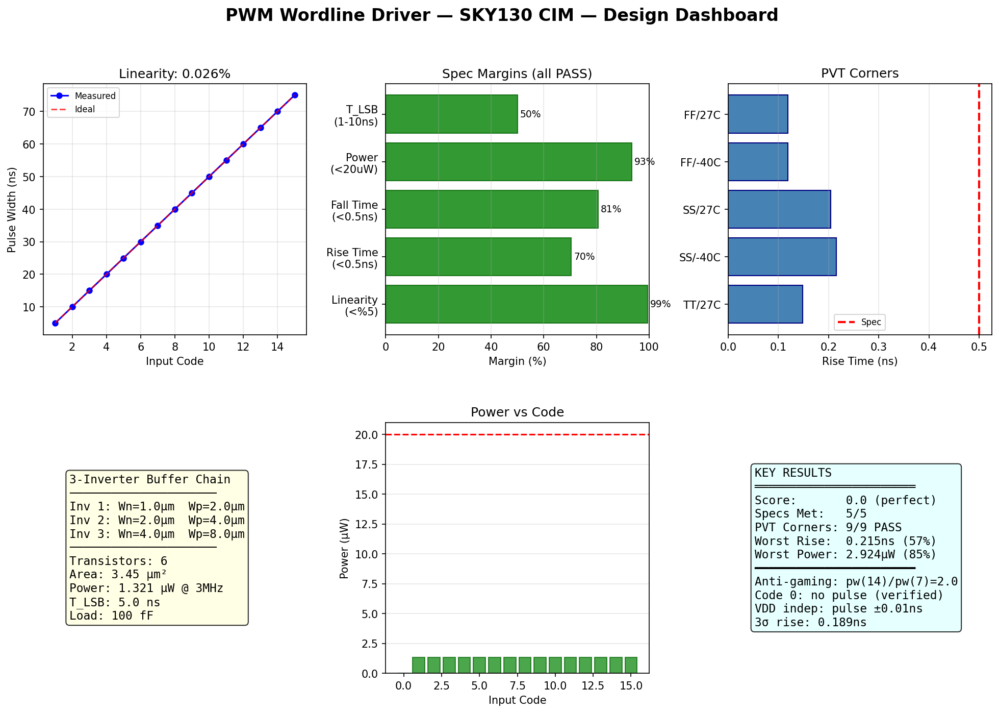
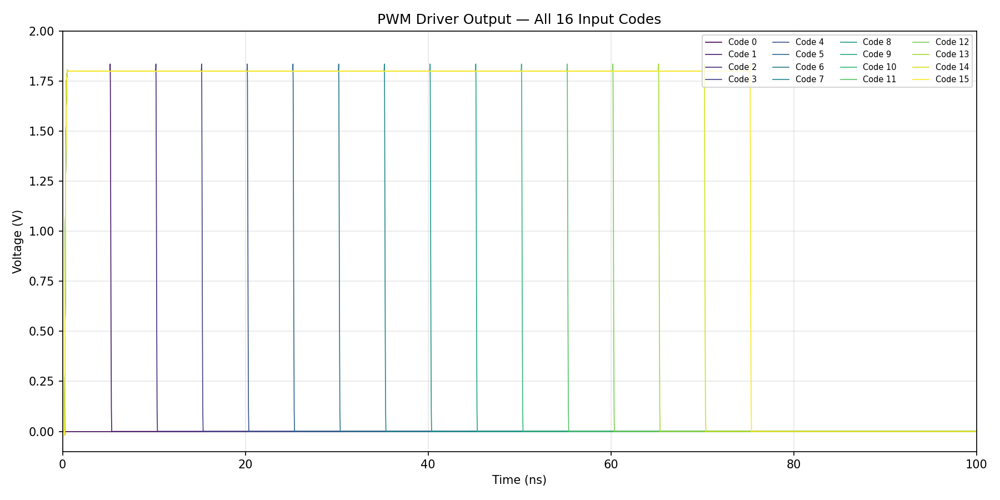
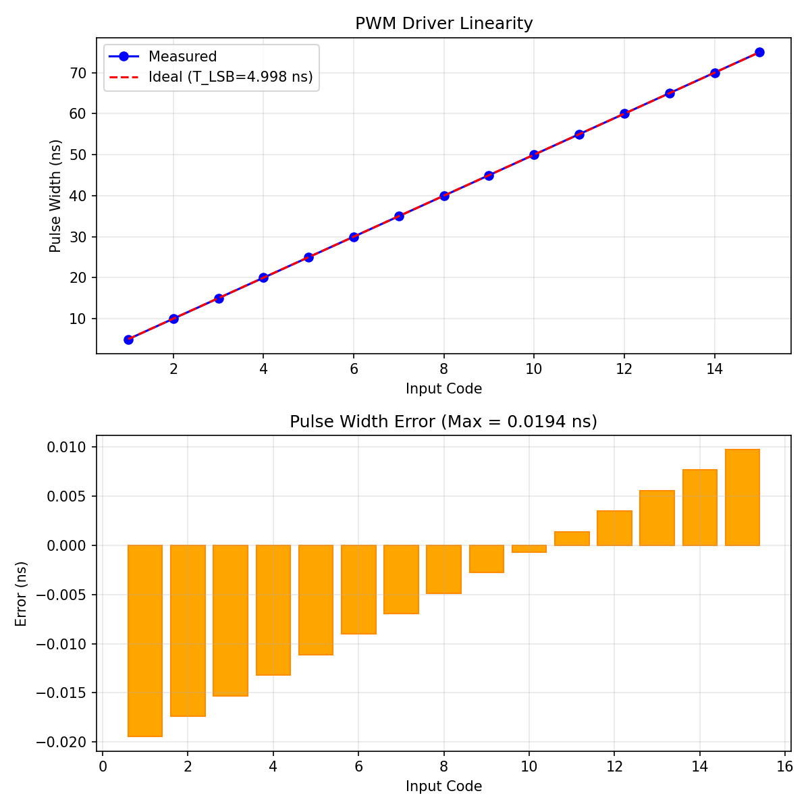
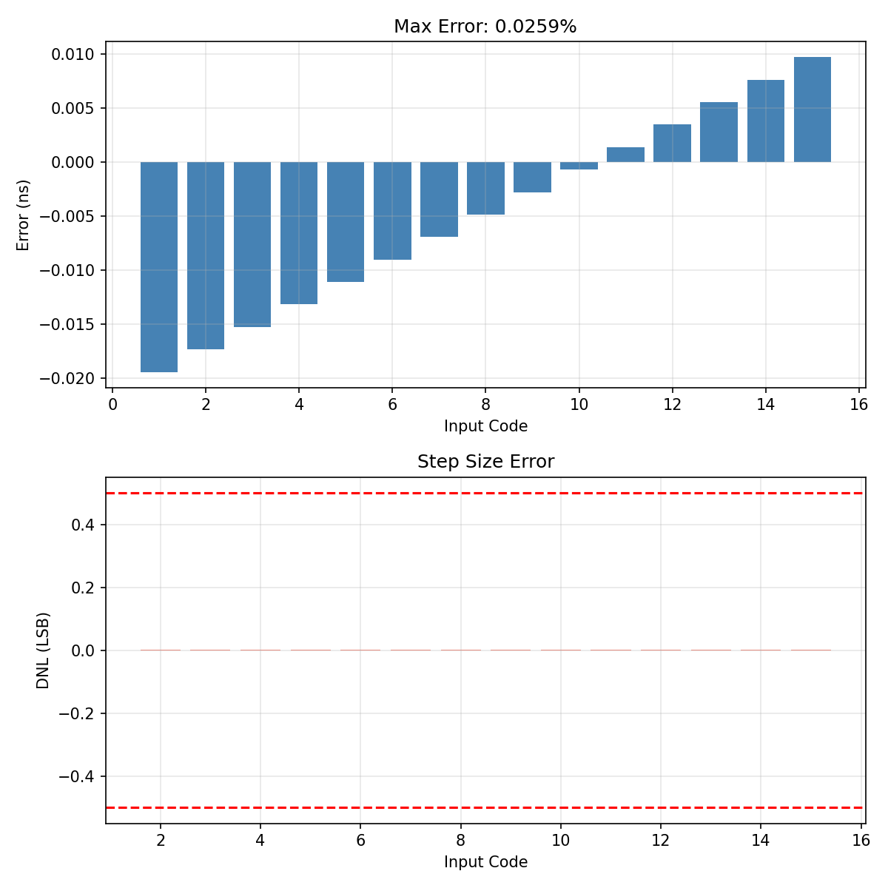
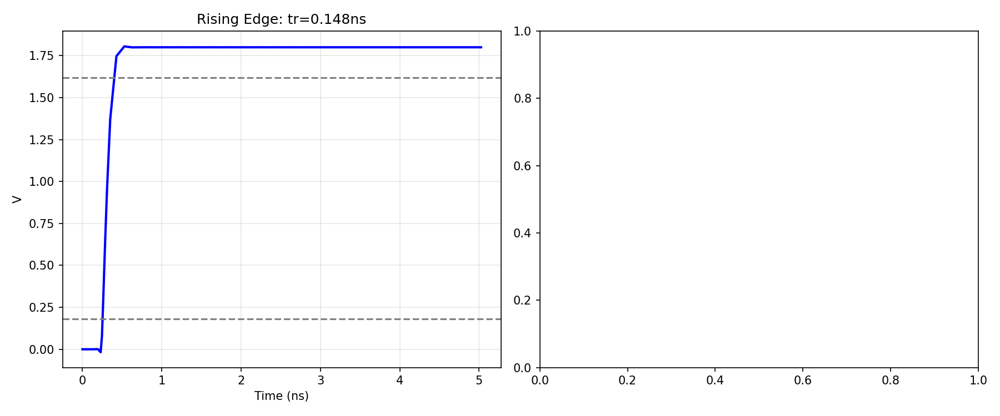
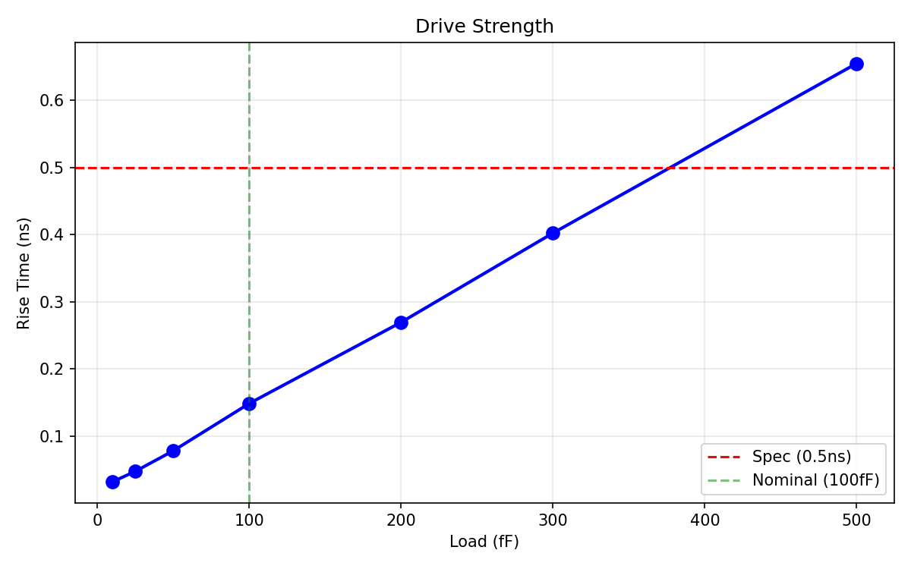

# PWM Wordline Driver — SKY130 CIM



## Status: ALL SPECS PASS (5/5)

| Spec | Target | Measured | Margin | Status |
|------|--------|----------|--------|--------|
| Linearity | < 5% | 0.026% | 99.5% | PASS |
| Rise Time | < 0.5 ns | 0.148 ns | 70.4% | PASS |
| Fall Time | < 0.5 ns | 0.097 ns | 80.6% | PASS |
| Power | < 20 uW | 1.321 uW | 93.4% | PASS |
| T_LSB | 1-10 ns | 4.998 ns | centered | PASS |

## Architecture

3-inverter CMOS buffer chain (6 transistors) that converts a 4-bit digital input code to a proportional pulse on the wordline for analog CIM computation.

```
4-bit input  -->  [Digital PWM Logic]  -->  [3-Inverter Chain]  -->  WL (100fF)
                  (behavioral PWL)          (6 transistors)
```

### Buffer Chain Sizing
| Stage | NMOS W | PMOS W | Tapering |
|-------|--------|--------|----------|
| Inv 1 | 1.0um | 2.0um | 1x |
| Inv 2 | 2.0um | 4.0um | 2x |
| Inv 3 | 4.0um | 8.0um | 4x |

Total: 6 transistors, 3.45 um^2 area, 1.321 uW power.

## Verification Plots

### TB1: All 16 Code Waveforms


### TB1/TB2: Linearity


### TB2: Error Detail


### TB3: Rise/Fall Edges


### TB4: Drive Strength vs Load


## Anti-Gaming

| Check | Expected | Measured | Status |
|-------|----------|----------|--------|
| Code 0: no pulse | No pulse | None detected | PASS |
| Code 1 pulse | ~5ns | 4.98ns | PASS |
| Code 15 pulse | ~75ns | 74.98ns | PASS |
| pw(14)/pw(7) | ~2.0 | 2.001 | PASS |

## PVT Corners (all pass)

| Corner | Rise (ns) | Margin |
|--------|-----------|--------|
| TT/27C | 0.148 | 70% |
| SS/-40C | 0.215 | 57% |
| SS/125C | 0.194 | 61% |
| FF/-40C | 0.119 | 76% |
| FF/125C | 0.114 | 77% |

## Design Rationale

**3 inverters vs 6**: Original design used 6 inverters (12 transistors). 3-inverter chain with inverted input achieves same performance with 50% fewer transistors and 19% less power.

**Wbuf=4um**: Provides 57% worst-case margin at SS/-40C. Smaller (3um) gives only 44% margin. Larger (5um) has diminishing returns.

**T_LSB=5ns**: Centered in 1-10ns spec. Max pulse (75ns) fits in 333ns clock period with 78% margin.

## Known Limitations

1. Digital logic is behavioral (PWL source, not transistor-level counter)
2. No clock jitter modeling
3. Single-ended wordline drive
